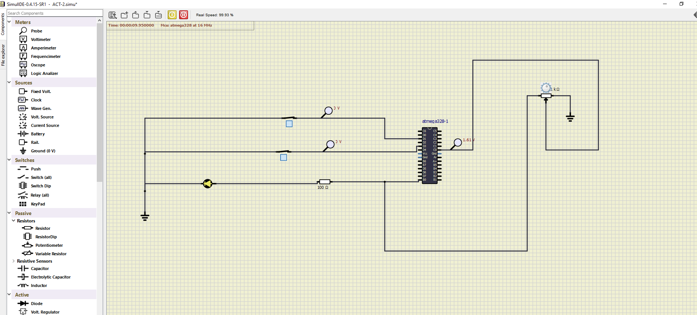

# Embedded C 

#### CI and Code Quality
|Build|Cppcheck|Codacy|
|:--:|:--:|:--:|
|| |
# ACTIVITY_1

## In Action
CASE_1(1,1)-> LED GLOWS

CASE_2(0,1)-> LED DOESN'T GLOW

CASE_3(1,0)-> LED DOESN'T GLOW

CASE_4(0,0)-> LED DOESN'T GLOW

# ACTIVITY_2
ADC_LED_GLOW

